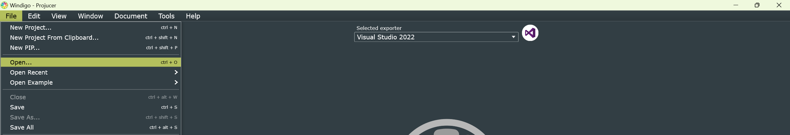
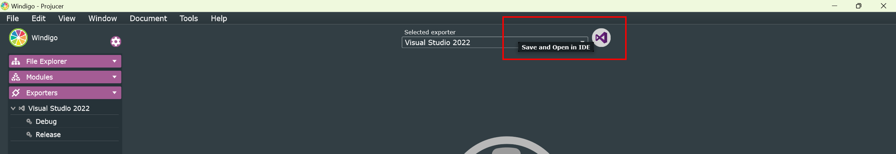
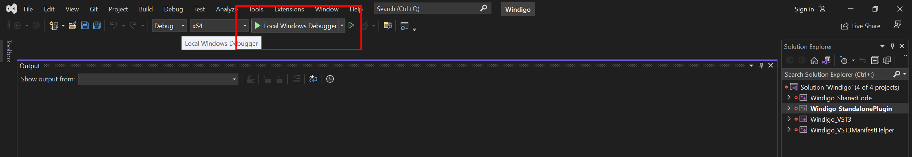
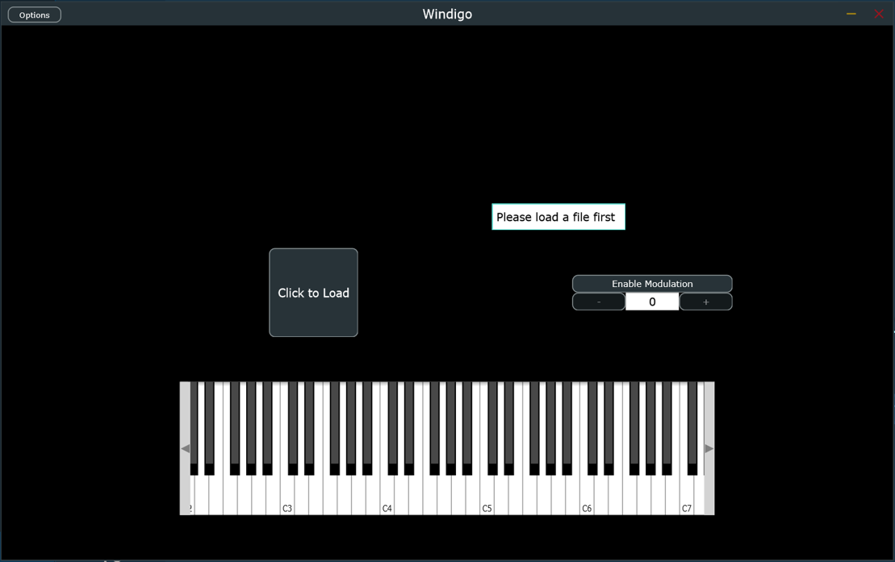

# Windigo

*Project under the NUS SoC Orbital Program*

Team ID: 6466 (Apollo 11)

### Usage

For Windows platforms, make sure to [download Visual Studio](https://visualstudio.microsoft.com/downloads/).

To build the application, first [download JUCE](https://juce.com/get-juce/). Once JUCE has been downloaded, open Projucer. In Projucer, open `Windigo.jucer`.



Export the project to Visual Studio. This should create the `Builds` and `JuceLibraryCode` directories.



Build the project and run the application.






### Project Structure

```
+-- windigo/
    +-- Builds (generated by Projucer)
    +-- Examples (contains demos of the pitch shifter)
    |   +-- results
    |   +-- samples
    |   +-- demo.cpp (CLI application entrypoint)
    |   +-- demo.ipynb (Jupyter Notebook to inspect audio files)
    |   +-- demo.sh (Bash script to pitch shift samples)
    |
    +-- Images (contains images used in this README)
    +-- JuceLibraryCode (generated by Projucer)
    +-- Source (contains the pitch shifter and GUI source code)
    |   + xxx.cpp
    |   + xxx.hpp
    |
    +-- Windigo.jucer (Projucer config file)
```